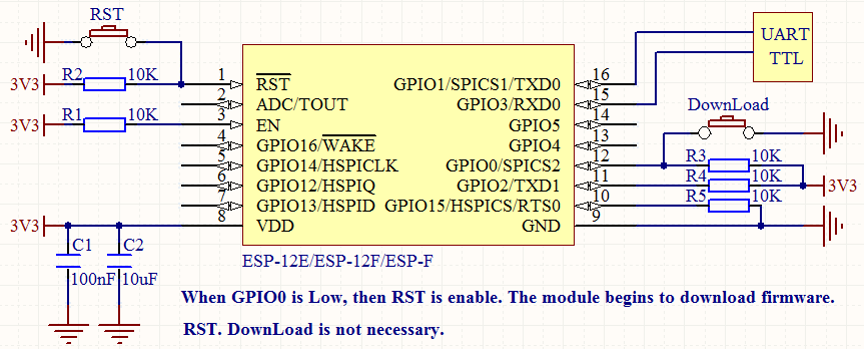

Ready to work
Prepare an ESP-F module of the DOITING brand or NODEMCU of the DOIT brand.

 
That is, VCC, EN connection 3.3v, GPIO15 GND grounding, module TX, RX connection serial port tool RX, TX, RST pin low level reset, unnecessary IO pin can be suspended, if you want to download the firmware in the module, please pull GPIO0 down processing (warm hint: if you buy ESP-01S/M/F1/F2, only need to connect VCC GND RX TX can work normally). If you buy an ESP-01 module, just connect CH-PD to VCC. Others can be connected according to the figure below (no IO port can not be connected). Please refer to the following instructions for product hardware design circuit.

1.2. Test

After completing the 1.1 connection, please check the circuit in detail and confirm that there is no problem. Open the debugging aid of serial port. The configuration mode is baud rate: 115200, data bit: 8 check bit: none stop bit: one flow control: none.
The configuration information is as follows:
To confirm that there is no problem, please press the RST reset key of K1 button (low level about 300m). Print the information as follows:
Display “read” to prove that the startup is normal.
Common Tools Download Connection: 
https://github.com/SmartArduino/SZDOITWiKi/wiki/Drivers%2CFirmwares%2C-and-Tools

Frequently problems:
1. Keyboard does not reflect
(1) Please check whether the power supply of the module is 3.3V/800ma.
(2) Please check whether TX and RX are in the wrong place.
(3) Check whether the port number is selected correctly and whether the port of serial debugging assistant is closed.
2. The keys are all scrambled.
(1) Please confirm the baud rate of the module with the module manufacturer.
(2) Please check whether USB to TTL is compatible with module communication. What is recommended is a USB to TTL made of CH340 and CP2102 chips?
(3) Make sure that there is something wrong with the program in the module. (I'll talk about how to burn firmware for modules later.)

1.Read IO status
AT + CIOREAD = 15        15 is GPIO15, the return value is 0OW (low level) OK
2.Set IO port status
AT + CIOWRITE = 2,1 // This instruction is an internal instruction of DOIT. 2 is a GPIO slogan, 1 is a high level, and 0 is a low level.
3. Smart distribution network (mobile app distribution network)
AT + CWSTARTSMART,   to provide APP with Espressif. Download ESP-TOUCH on the official website of Espressif: http://espressif.com/en-us/support/download/documents
http://bbs.doit.am/forum.php?mod=viewthread&tid=431&highlight=%E9%85%8D%E7%BD%91
4.Query chip ID
AT + CSYSID
The return value is as follows + CSYSID: CHIP: 000FDD04; FLASH: 001640E0; KEYD6D800C
5.Set the baud rate
AT + UART_DEF = 9600,8,1,0,0   Modify the baud rate of the serial port and save it to flash. The valid module for the second power on does not support hardware flow control.
6.Save TCP / UDP transparent transmission instructions
AT + SAVETRANSLINK = 1, "192.168.6.110", 1002, "TCP" 1 Turn on and enter the transparent transmission mode. 192.168.6.110 represents the remote IP and 1002 remote port. For details, refer to the at instruction set.
7, TCP server
AT + CIPSERVER = 0 returns OK
8. Set sleep mode (normally 70ma, maximum transmit power 500ma) AT + SLEEP = 0 0 is forbidden sleep mode.
      1 power consumption of 20ma for light-sleep mode 2 power consumption of 70ma for modem-sleep mode (available only when wif is connected in sta mode) sleep mode only takes effect in single station mode, the default is modem-sleep, please refer to the instruction set .
9. Restore the factory settings (you can use this command if the distribution fails)
AT + RESTORE
10.Print AP's Mac
AT + CIFSR
11.Set STA mode MAC address
AT + CIPSTAMAC = "18: fe: 35: 98: d3: 7b"
[size = 12.0000pt] 12. WeChat distribution network
  AT + CWSMARTSTART = 2
There are many more about the AT instruction, please refer to the official AT instruction document
4A-ESP8266__AT Instruction Set__CN_v1.
