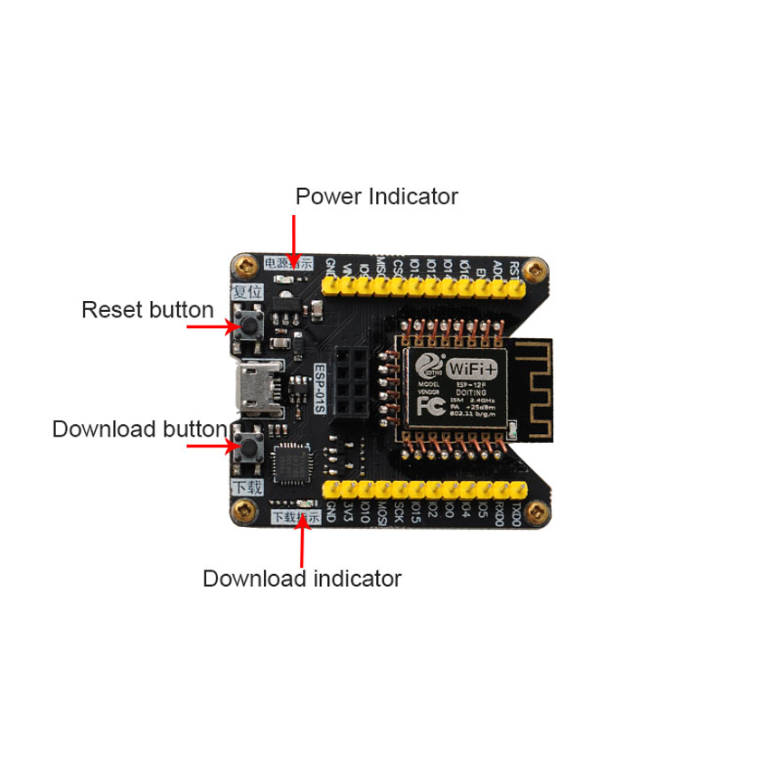

Prepare an esp-f module of Shenzhen Doit Technology Co., Ltd., or a nodemcu of Doit Technology Co., Ltd
The link is as follows:

 http://bbs.doit.am/forum.php?mod=viewthread&tid=438&extra=
 
  
  
## 8266/8285 programming instructions are as follows:

  
 
  
  
  Note: The selection information of the red box and the FLASH memory size of the module used. There are two types of module FLASH commonly used in the market: 1MB = 8Mbit and 4MB = 32Mbit. Please select the corresponding file for burning. If you cannot determine the size, you can choose the smallest FLASH for burning.
## Test
1. Please open the serial port debugging assistant. The configuration mode is baud rate: 115200, data bits: 8 parity bit: none stop bit: one flow control: none
The configuration information is as follows:
Confirm that there is no problem, press a RST reset button (low level of about 300m), and the print information is as follows:
The display shows ready to start normally.

  
 
## Explanation of startup information:
The serial port baud rate is set to 74880. You can see the current startup information of the module:

 
 
 When the display is 1, the module is in download mode
 
 
 
 If the display is 3, the module starts normally;
Please refer to the official manual for details

## 2. Check whether there is a WIFI hotspot at the beginning of DOIT.

 
 
 If the module used encounters the following problems:
           1.The keys are not reflected
           (1) Please check whether the power supply of the module is 3.3V / 800ma;
           (2) Please check if TX and RX are in the wrong position;
           (3) Check whether the port number is selected correctly and whether the port of the serial port debugging assistant is closed.
         2.The keys are all garbled
           (1) Make sure the baud rate of the module is 115200;
           (2) Please check whether the USB to TTL communication with the module is a compatibility issue. It is recommended to use the USB to TTL made by CH340 and CP2102 chips.
           (3) Please confirm whether the selection during module programming is in accordance with the above operation.

## 4. Common functions.
1. After the test works normally, turn on the mobile WIFI. Find the WIFI hotspot starting with DOIT and click Connect.
2. Open your mobile browser. Enter 192.168.4.1. As shown below;

 

 
 
 You can set the baud rate, data bit, parity bit and stop bit of the module.
Main solution: If the user does not remember the original baud rate, he cannot communicate with the module, which can be viewed or modified through the web page.
3. You can modify the AP hotspot, password, encryption method, IP and MAC address of the module.

4. The module can be directly configured through the web page. No need to AT command through serial port. When the module is successfully networked. The module's GPIO2 pin will go low. The GPIO2 link indicator will be lit. As shown below

## 5.Using serial port to do TCP serve in AP mode
AT + CWMODE = 2       Enable AP mode (serial port assistant)
AT + CWSAP = "ESP8266", "0123456789", 11,0      Set the wifi and password of the module (serial port assistant)
AT + CIPMUX = 1       open multi-connection (serial port assistant)
AT + CIPSERVER = 1,8899    Set the module server port (serial port assistant),
Open the phone to start the setting: Please turn on the computer to connect to the AP hotspot ESP8266 established by the module. And open the network debugging assistant, enter the IP of the connection module and the set port. As shown in the figure below, the default IP of the module is 192.168.4.1, and the port is set to 8899 (the default is 333) (network debugging assistant)
AT + CIPSEND = 0,11      Enter the data transmission mode for 11 bytes (serial port assistant)
	          Enter Send Mode (Serial Assistant)
11 data sent by www.doit.am (serial port assistant)
Network debugging assistant sends data:    Shenzhen Sibo Zhilian Technology Co., Ltd. (Network debugging assistant)

* If you want to set the device to enter the transparent transmission mode, please refer to the common instructions in the following documents. For more detailed instructions, please refer to the official AT instruction file.

## 6. Module TCP client transparent transmission mode
AT + CWMODE = 1     Set the module to STA mode. (Serial Assistant)
AT + CWLAP    query nearby WIFI (serial port assistant)
AT + CWJAP = "123123", "12345678"   WIFI (serial port assistant) connected to the router
AT + CIFSR    View the IP address assigned to the module by the router, such as 192.168.43.103 (serial port assistant)
AT + CIPMUX = 0     set single connection (serial port assistant)
AT + CIPMODE = 1    Set transparent transmission mode (serial port assistant)
Network debugging assistant settings Connect the computer to the router, open the network debugging assistant, configure the TCP server port 8899, and check the IP assigned to the computer by the router 192.168.43.104.
AT + CIPSTART = "TCP", "192.168.43.104", 8899 Connect to the TCP server (serial port assistant) established on the mobile phone
AT + CIPSEND       starts sending data (serial port assistant)
>      Enter Send Mode (Serial Assistant)
www.doit.am         Send data (serial port assistant)
+++        Pay attention to exit transparent transmission and send directly. Cancel new line
Network debugging assistant sends data: Shenzhen Sibo Zhilian Technology Co., Ltd. (Network debugging assistant)

* Note that transparent transmission can only be performed in single connection mode, so be sure to use it before setting up a connection (AT + CIPMUX = 0 to set single connection), but when the module is in server mode, multiple links must be used. Due to conflicts, the module Cannot do TCP transparent transmission when server mode is enabled!

 
 

