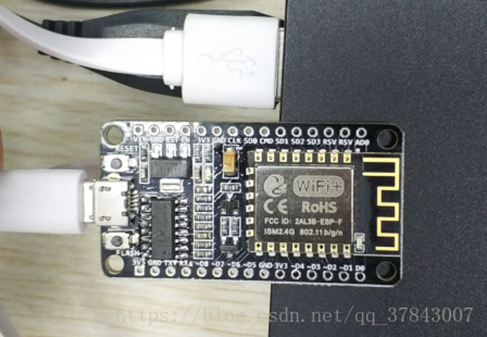

1.	Use a NODEMCU development board from Shenzhen Sibo Zhilian Technology Co., Ltd.

3. Download the SDK compression package of MQTT, please see the attachment.

4. Open MQTT SDK with the official Eclipse.

5. Open mqtt_config.h in the include folder. You can see the following setting information. You can set it according to your network and server.

6. After the setting is completed, select it, click the mqtt file, right-click and click on the Bulid project.

7. Wait for the compilation to complete and check the Console. View the compiled file and compiled burning address.

8. Open Espressif's programming tool. http://bbs.doit.am/forum.php?mod ... 196 & highlight = tools
As shown in the figure below: Make settings. The burning file is under the bin folder in the mqtt project file.

9, test, open the serial debugging assistant.
Tested as follows:

Note: The server in the SDK has been disabled.
For specific questions, please contact qq: 994715739

Mqtt compressed package download address:
http://bbs.doit.am/forum.php?mod=attachment&aid=Njc0fDhmNDhkYTlifDE1ODEzMTc3NDh8MHw0NDE%3D

