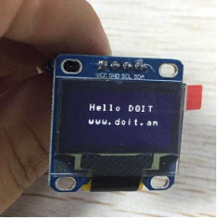

## 1.Hardware
Prepare  a nodemcu of Doit Technology Co., Ltd
 An OLED screen, a USB cable, 4 DuPont cables, a router, and a computer with Internet access.

3V3---VCC
GND---GND
GPIO4(D2)---SDA
GPIO5(D1)---SCL

## 2.Set up the router
Set router account to set router account to
Account number: doiting
Password:doiting.com
## 3. Burning program
Open the ESP_TOOLS download tool and select 8266.
Tool download: http://bbs.doit.am/forum.php?mod=viewthread&tid=196&highlight=TOO

Click START. Wait for the programming to complete.

Reset nodemcu after programming is complete. Wait for about 10s.

The test results are as follows:

For specific questions, please contact qq: 994715739

Arduino code is as follows
#include <ESP8266WiFi.h>
#include <ArduinoJson.h>
#include <Wire.h>
#include "OLED.h"
static const char logo[] PROGMEM={
0xff,0xff,0xff,0xff,0xff,0xff,0xff,0xff,0xff,0xff,0xff,0xff,0xff,0xff,0xff,0x7f,
0xff,0xff,0xff,0xff,0xff,0xff,0xff,0xff,0xff,0xff,0xff,0xff,0xff,0xff,0xff,0x7f,
0xff,0xff,0xff,0xff,0xff,0xff,0x7f,0x80,0xff,0xff,0xff,0xff,0xff,0xff,0xff,0x7f,
0xff,0xff,0xff,0xff,0xff,0xff,0x03,0x00,0xf0,0xff,0xff,0xff,0xff,0xff,0xff,0x7f,
0xff,0xff,0xff,0xff,0xff,0x7f,0x00,0x00,0x80,0xff,0xff,0xff,0xff,0xff,0xff,0x7f,
0xff,0xff,0xff,0xff,0xff,0x0f,0x00,0x00,0x00,0xfe,0xff,0xff,0xff,0xff,0xff,0x7f,
0xff,0xff,0xff,0xff,0xff,0x03,0x00,0x00,0x00,0xf8,0xff,0xff,0xff,0xff,0xff,0x7f,
0xff,0xff,0xff,0xff,0xff,0xe0,0xff,0x03,0x00,0xe0,0xff,0xff,0xff,0xff,0xff,0x7f,
0xff,0xff,0xff,0xff,0x1f,0x1c,0xf0,0x1f,0x00,0x80,0xff,0xff,0xff,0xff,0xff,0x7f,
0xff,0xff,0xff,0xff,0x0f,0x00,0x80,0x7f,0x00,0x00,0xff,0xff,0xff,0xff,0xff,0x7f,
0xff,0xff,0xff,0xff,0x0f,0x00,0x00,0xff,0x01,0x00,0xfc,0xff,0xff,0xff,0xff,0x7f,
0xff,0xff,0xff,0xff,0x07,0x00,0x00,0xfe,0x03,0x00,0xf8,0xff,0xff,0xff,0xff,0x7f,
0xff,0xff,0xff,0xff,0x03,0x00,0x00,0xfc,0x07,0x00,0xf8,0xff,0xff,0xff,0xff,0x7f,
0xff,0xff,0xff,0xff,0x01,0x00,0x00,0xf8,0x0f,0x00,0xf0,0xff,0xff,0xff,0xff,0x7f,
0xff,0xff,0xff,0xff,0x00,0x00,0x00,0xf0,0x1f,0x00,0xf0,0xff,0xff,0xff,0xff,0x7f,
0xff,0xff,0xff,0x3f,0x00,0x00,0x00,0xf0,0x1f,0x00,0xf0,0xff,0xff,0xff,0xff,0x7f,
0xff,0xff,0xff,0x1f,0x00,0x00,0x00,0xf0,0x1f,0x00,0xf0,0xff,0xff,0xff,0xff,0x7f,
0xff,0xff,0xff,0x1f,0x00,0x00,0x00,0xf0,0x1f,0x00,0xf0,0xff,0xff,0xff,0xff,0x7f,
0xff,0xff,0xff,0x0f,0x00,0x00,0x00,0xf0,0x3f,0x00,0xf0,0xff,0xff,0xff,0xff,0x7f,
0xff,0xff,0xff,0x07,0x00,0x00,0x00,0xf0,0x1f,0x00,0xf8,0xff,0xff,0xff,0xff,0x7f,
0xff,0xff,0xff,0x07,0x00,0x00,0x00,0xf0,0x0f,0x00,0xf8,0xff,0xff,0xff,0xff,0x7f,
0xff,0xff,0xff,0x03,0x00,0x00,0x00,0xf8,0x03,0x00,0xfc,0xff,0xff,0xff,0xff,0x7f,
0xff,0xff,0xff,0x01,0x00,0x00,0x00,0xfc,0x00,0x00,0x7e,0xff,0xff,0xff,0xff,0x7f,
0xff,0xff,0xff,0x01,0x00,0x00,0x00,0x7f,0x00,0x00,0x7f,0xf8,0xff,0xff,0xff,0x7f,
0xff,0xff,0xff,0x00,0x00,0x00,0x80,0x1f,0x00,0x80,0x7f,0xf8,0xff,0xff,0xff,0x7f,
0xff,0xff,0xff,0x00,0x00,0x00,0xe0,0x07,0x00,0xc0,0x3f,0xf0,0xff,0xff,0xff,0x7f,
0xff,0xff,0xff,0x00,0x00,0x00,0xf8,0x01,0x00,0xe0,0x3f,0xf0,0xff,0xff,0xff,0x7f,
0xff,0xff,0x7f,0x00,0x00,0x00,0x7f,0x00,0x00,0xf8,0x3f,0xf0,0xff,0xff,0xff,0x7f,
0xff,0xff,0x7f,0x00,0x00,0xe0,0x1f,0x00,0x00,0xfe,0x0f,0xf0,0xff,0xff,0xff,0x7f,
0xff,0xff,0x7f,0x00,0x00,0xf8,0x03,0x00,0x80,0xff,0x0f,0xf8,0xff,0xff,0xff,0x7f,
0xff,0xff,0x7f,0x00,0x00,0x7e,0x00,0x00,0xe0,0xff,0x01,0xf0,0xff,0xff,0xff,0x7f,
0xff,0xff,0x7f,0x00,0x00,0x1f,0x00,0x00,0xf8,0xff,0x00,0xf8,0xff,0xff,0xff,0x7f,
0xff,0xff,0x7f,0x00,0xc0,0x0f,0x00,0x00,0xfe,0x7f,0x00,0xfc,0xff,0xff,0xff,0x7f,
0xff,0xff,0x7f,0x00,0xe0,0x03,0x00,0x80,0xff,0x1f,0x00,0xfe,0xff,0xff,0xff,0x7f,
0xff,0xff,0x7f,0x00,0xf8,0x01,0x00,0xe0,0xff,0x07,0x00,0xfe,0xff,0xff,0xff,0x7f,
0xff,0xff,0x7f,0x00,0x7c,0x00,0x00,0xfc,0xff,0x00,0x00,0xfc,0xff,0xff,0xff,0x7f,
0xff,0xff,0x7f,0x00,0x3e,0x00,0x00,0xff,0x07,0x00,0x00,0xfc,0xff,0xff,0xff,0x7f,
0xff,0xff,0x7f,0x00,0x0f,0x00,0xc0,0xff,0x07,0x00,0x00,0xff,0xff,0xff,0xff,0x7f,
0xff,0xff,0xff,0x80,0x07,0x00,0xf0,0xff,0xff,0x0f,0xc0,0xff,0xff,0xff,0xff,0x7f,
0xff,0xff,0xff,0xc0,0x03,0x00,0xf8,0xff,0xff,0x3f,0xf8,0xff,0xff,0xff,0xff,0x7f,
0xff,0xff,0xff,0xc0,0x01,0x00,0xfe,0xf8,0xc7,0xff,0xff,0xff,0xff,0xff,0xff,0x7f,
0xff,0xff,0xff,0xe1,0x01,0x00,0x7f,0xc0,0x03,0x87,0x00,0xfe,0xff,0xff,0xff,0x7f,
0xff,0xff,0xff,0xe1,0x00,0xc0,0x7f,0x80,0x01,0x86,0x00,0xfe,0xff,0xff,0xff,0x7f,
0xff,0xff,0xff,0x63,0x00,0xe0,0x7f,0x80,0x01,0x86,0x00,0xfe,0xff,0xff,0xff,0x7f,
0xff,0xff,0xff,0x63,0x00,0xe0,0x7f,0x8c,0x31,0x86,0xc3,0xff,0xff,0xff,0xff,0x7f,
0xff,0xff,0xff,0x67,0x00,0xc0,0x7f,0x8c,0x31,0x86,0x83,0xff,0xff,0xff,0xff,0x7f,
0xff,0xff,0xff,0x6f,0x00,0xc0,0x7f,0x8c,0x31,0x86,0x83,0xff,0xff,0xff,0xff,0x7f,
0xff,0xff,0xff,0x7f,0x00,0xc0,0x7f,0x8c,0x31,0x86,0x83,0xff,0xff,0xff,0xff,0x7f,
0xff,0xff,0xff,0x7f,0x00,0xc0,0x7f,0x8c,0x31,0x86,0x83,0xff,0xff,0xff,0xff,0x7f,
0xff,0xff,0xff,0xff,0x00,0x80,0x7f,0x80,0x01,0x86,0x83,0xff,0xff,0xff,0xff,0x7f,
0xff,0xff,0xff,0xff,0x01,0x00,0x7f,0x80,0x01,0x86,0x83,0xff,0xff,0xff,0xff,0x7f,
0xff,0xff,0xff,0xff,0x03,0x00,0x7c,0xc0,0x03,0x87,0x83,0xff,0xff,0xff,0xff,0x7f,
0xff,0xff,0xff,0xff,0x07,0x00,0xf8,0xff,0xff,0xf1,0xff,0xff,0xff,0xff,0xff,0x7f,
0xff,0xff,0xff,0xff,0x0f,0x00,0xe0,0xff,0x7f,0xf0,0xff,0xff,0xff,0xff,0xff,0x7f,
0xff,0xff,0xff,0xff,0x3f,0x00,0x00,0xfe,0x07,0xfc,0xff,0xff,0xff,0xff,0xff,0x7f,
0xff,0xff,0xff,0xff,0x7f,0x00,0x00,0x00,0x00,0xff,0xff,0xff,0xff,0xff,0xff,0x7f,
0xff,0xff,0xff,0xff,0xff,0x03,0x00,0x00,0xe0,0xff,0xff,0xff,0xff,0xff,0xff,0x7f,
0xff,0xff,0xff,0xff,0xff,0x0f,0x00,0x00,0xfc,0xff,0xff,0xff,0xff,0xff,0xff,0x7f,
0xff,0xff,0xff,0xff,0xff,0x7f,0x00,0x80,0xff,0xff,0xff,0xff,0xff,0xff,0xff,0x7f,
0xff,0xff,0xff,0xff,0xff,0xff,0x3f,0xff,0xff,0xff,0xff,0xff,0xff,0xff,0xff,0x7f,
0xff,0xff,0xff,0xff,0xff,0xff,0xff,0xff,0xff,0xff,0xff,0xff,0xff,0xff,0xff,0x7f,
0xff,0xff,0xff,0xff,0xff,0xff,0xff,0xff,0xff,0xff,0xff,0xff,0xff,0xff,0xff,0x7f,
0xff,0xff,0xff,0xff,0xff,0xff,0xff,0xff,0xff,0xff,0xff,0xff,0xff,0xff,0xff,0x7f,
0xff,0xff,0xff,0xff,0xff,0xff,0xff,0xff,0xff,0xff,0xff,0xff,0xff,0xff,0xff,0x7f
};
OLED display(4, 5);

const char* ssid     = "doiting";       
const char* password = "doiting.com";         
const char* host = "api.seniverse.com";
const char* APIKEY = "wcmquevztdy1jpca";        //API KEY
const char* city = "shenzhen";
const char* language = "en"; 

const unsigned long BAUD_RATE = 115200;                   // serial connection speed
const unsigned long HTTP_TIMEOUT = 5000;               // max respone time from server
const size_t MAX_CONTENT_SIZE = 1000;                   // max size of the HTTP response

struct UserData {
  char city[16]; 
  char weather[32]; 
  char temp[16]; 
  char udate[32]; 
};

WiFiClient client;
char response[MAX_CONTENT_SIZE];
char endOfHeaders[] = "\r\n\r\n";

void setup() {
  WiFi.mode(WIFI_STA);    
  Serial.begin(BAUD_RATE);
  delay(10);
  Serial.println();
  Serial.println();
  Serial.print("Connecting to "); 
  Serial.println(ssid);
  WiFi.begin(ssid, password);
  while (WiFi.status() != WL_CONNECTED) {
    delay(100);
    Serial.print(".");
  }
  Serial.println("");
  Serial.println("WiFi connected");
  delay(100);
  Serial.println("IP address: ");
  Serial.println(WiFi.localIP());
  client.setTimeout(HTTP_TIMEOUT);

}

void loop() {
  display.begin();

  display.print("Hello DOIT",2,3);
  display.print("www.doit.am",4,3);
  delay(2*1000);
  display.clear();

  while (!client.connected()){
     if (!client.connect(host, 80)){
         Serial.println("connection....");
         delay(100);
     }
  }
  if (sendRequest(host, city, APIKEY) && skipResponseHeaders()) {
    clrEsp8266ResponseBuffer();
    readReponseContent(response, sizeof(response));
    UserData userData;
    if (parseUserData(response, &userData)) {
      printUserData(&userData);
    }
  }
  delay(300); 
}

bool sendRequest(const char* host, const char* cityid, const char* apiKey) {
  // We now create a URI for the request
  String GetUrl = "/v3/weather/now.json?key=";
  GetUrl += apiKey;
  GetUrl += "&location=";
  GetUrl += city;
  GetUrl += "&language=";
  GetUrl += language;
  // This will send the request to the server
  client.print(String("GET ") + GetUrl + " HTTP/1.1\r\n" +
               "Host: " + host + "\r\n" +
               "Connection: close\r\n\r\n");
  Serial.println("create a request:");
  Serial.println(String("GET ") + GetUrl + " HTTP/1.1\r\n" +
               "Host: " + host + "\r\n" +
               "Connection: close\r\n");
  delay(100);
  return true;
}

bool skipResponseHeaders() {
  // HTTP headers end with an empty line
  bool ok = client.find(endOfHeaders);
  if (!ok) {
    Serial.println("No response or invalid response!");
  }
  return ok;
}
void readReponseContent(char* content, size_t maxSize) {
  size_t length = client.peekBytes(content, maxSize);
  delay(100);
  Serial.println("Get the data from Internet!");
  content[length] = 0;
  Serial.println(content);
  Serial.println("Read data Over!");
  client.flush();}

bool parseUserData(char* content, struct UserData* userData) {
  DynamicJsonBuffer jsonBuffer;

  JsonObject& root = jsonBuffer.parseObject(content);

  if (!root.success()) {
    Serial.println("JSON parsing failed!");
    return false;
  }

  strcpy(userData->city, root["results"][0]["location"]["name"]);
  strcpy(userData->weather, root["results"][0]["now"]["text"]);
  strcpy(userData->temp, root["results"][0]["now"]["temperature"]);
  strcpy(userData->udate, root["results"][0]["last_update"]);
  return true;
}

void printUserData( struct UserData* userData) {
  Serial.println("Print parsed data :");
  display.print("City: ",0,0);
  display.print(userData->city,0,6);
  display.print("Weat: ",2,0);
  display.print(userData->weather,2,6);
  display.print("Temp: ",4,0);
  display.print(userData->temp,4,6);
// display.print("Last Updata : ",7,2);
display.print(userData->udate,6,0);
// display.print("\r\n");
delay(4*1000);
}

void stopConnect() {
  Serial.println("Disconnect");
  client.stop();
}

void clrEsp8266ResponseBuffer(void){
    memset(response, 0, MAX_CONTENT_SIZE);     
}
## 
Arduino Source:
http://bbs.doit.am/forum.php?mod=attachment&aid=Njg4fGZjZWNhODcyfDE1ODEzMTY3Mjh8MHw0NDI%3D

Module burning file:
http://bbs.doit.am/forum.php?mod=attachment&aid=Njg3fDk0MTA4MTk0fDE1ODEzMTY3Mjh8MHw0NDI%3D

