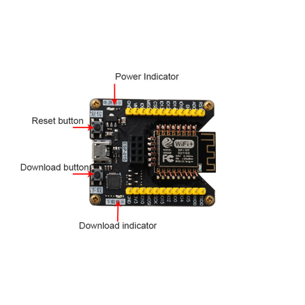
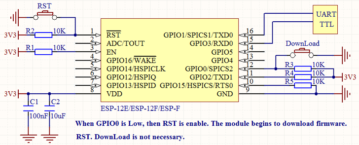
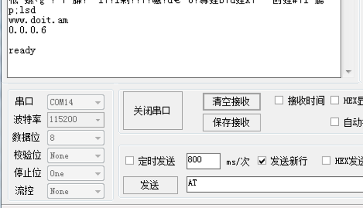
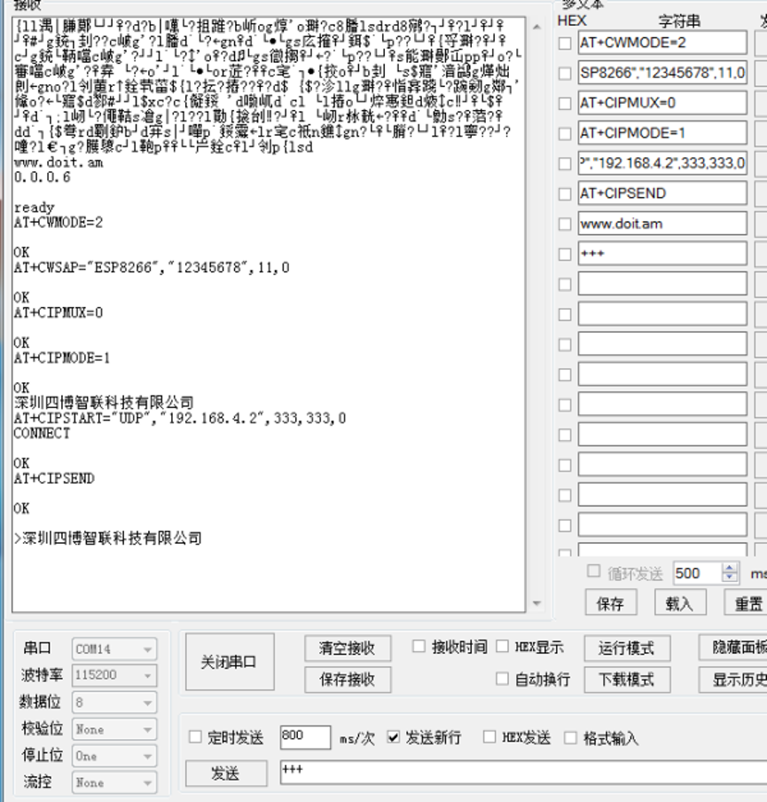

Ready to work
Prepare an ESP-F module of the DOITING brand or NODEMCU of the DOIT brand.

That is, VCC, EN connection 3.3v, GPIO15 GND grounding, module TX, RX connection serial port tool RX, 
TX, RST pin low level reset, unnecessary IO pin can be suspended, if you want to download the firmware
in the module, please pull GPIO0 down processing (warm hint: if you buy ESP-01S/M/F1/F2, only need to
connect VCC GND RX TX can work normally). If you buy an ESP-01 module, just connect CH-PD to VCC. Others 
can be connected according to the figure below (no IO port can not be connected). Please refer to the following
instructions for product hardware design circuit.

## TEST

After completing the 1.1 connection, please check the circuit in detail and confirm that there is no problem. Open the debugging aid of serial port. The configuration mode is baud rate: 115200, data bit: 8 check bit: none stop bit: one flow control: none.
The configuration information is as follows:
To confirm that there is no problem, please press the RST reset key of K1 button (low level about 300m). Print the information as follows:
Display “read” to prove that the startup is normal.
Common Tools Download Connection: 
https://github.com/SmartArduino/SZDOITWiKi/wiki/Drivers%2CFirmwares%2C-and-Tools

Frequently problems:
1. Keyboard does not reflect
(1) Please check whether the power supply of the module is 3.3V/800ma.
(2) Please check whether TX and RX are in the wrong place.
(3) Check whether the port number is selected correctly and whether the port of serial debugging assistant is closed.
2. The keys are all scrambled.
(1) Please confirm the baud rate of the module with the module manufacturer.
(2) Please check whether USB to TTL is compatible with module communication. What is recommended is a USB to TTL made of CH340 and CP2102 chips?
(3) Make sure that there is something wrong with the program in the module. (I'll talk about how to burn firmware for modules later.)

Frequently problems:
1. Keyboard does not reflect
(1) Please check whether the power supply of the module is 3.3V/800ma.
(2) Please check whether TX and RX are in the wrong place.
(3) Check whether the port number is selected correctly and whether the port of serial debugging assistant is closed.
2. The keys are all scrambled.
(1) Please confirm the baud rate of the module with the module manufacturer.
(2) Please check whether USB to TTL is compatible with module communication. What is recommended is a USB to TTL made of CH340 and CP2102 chips?
(3) Make sure that there is something wrong with the program in the module. (I'll talk about how to burn firmware for modules later.)

1.	UDP transmission mode of two modules

Must be two serial port assistants and both modules must work at the same time, remember not to power off and disconnect the serial port!
一, as an AP module
AT + CWMODE = 2         Set the module to AP mode (Serial Assistant 1)
AT + CWSAP = "ESP8266", "12345678", 11,0        Set the hotspot of the AP module (Serial Assistant 1)
AT + CIPMUX = 0         Set single connection of the module (Serial Assistant 1)
AT + CIPMODE = 1        Set the transparent transmission mode (Serial Assistant 1)
Go to set the serial assistant of module two. After accepting the data, proceed as follows.
AT + CIPSTART = "UDP", "192.168.4.2", 333,333,0           Set the IP and port of the UDP STA to be connected. This IP is the IP assigned by the AP module to the STA module.
AT + CIPSEND           Set the send command to send data
>
www.doit.am            send data

